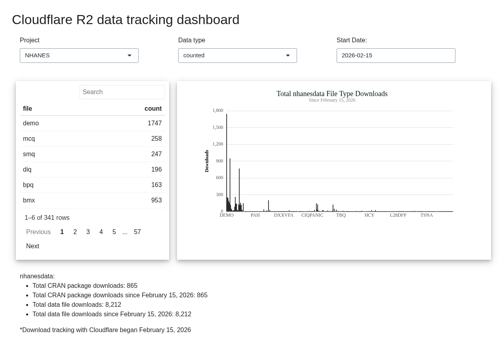
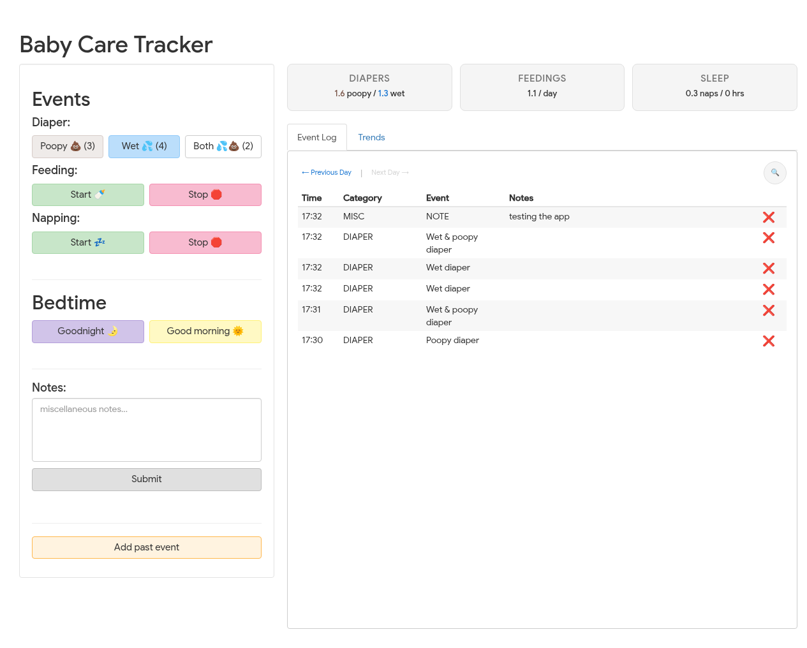
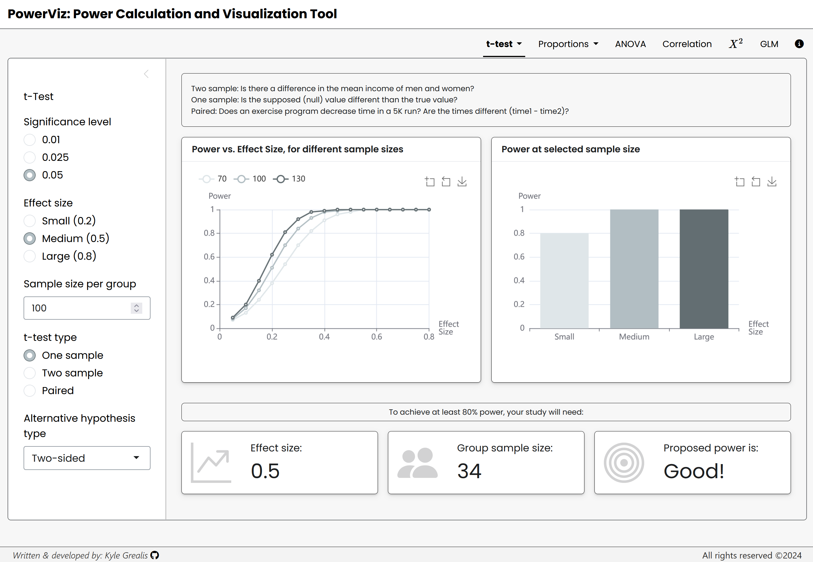
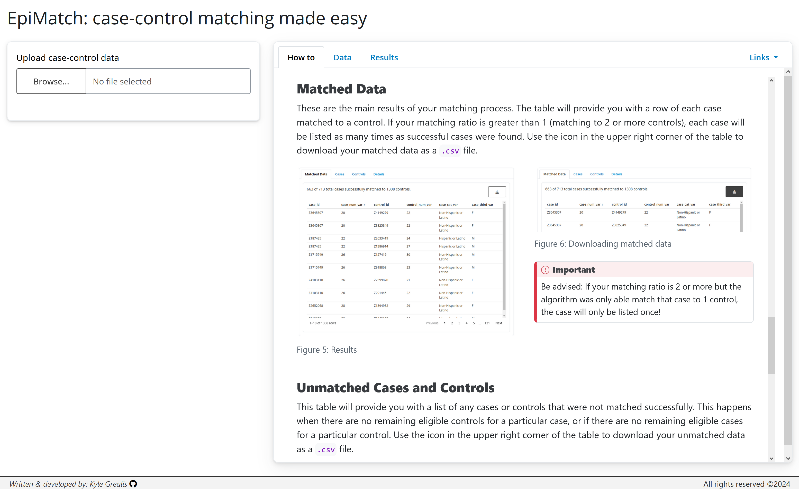

::: { .img-text }

::: { .img-group }
{target="_blank"}
:::

::: { .text-grp }

### R2 Dashboard

A Shiny dashboard for tracking and visualizing data stored in Cloudflare R2. Built as a personal tool for managing and exploring datasets without leaving the browser.

::: { .cntr-btn }
[Try it!](https://shiny.kylegrealis.com/r2-dashboard){target="_blank" .btn}
:::

:::

:::

---

::: { .img-text }

::: { .img-group }
{target="_blank"}
:::

::: { .text-grp }

### Baby Tracker

A Shiny app for tracking feeding, sleep, and daily patterns for a newborn. Built for Sofia. It does what the name says.

::: { .cntr-btn }
[Try it!](https://shiny.kylegrealis.com/baby-tracker){target="_blank" .btn}
:::

:::

:::

---

::: { .img-text }

::: { .img-group }
{target="_blank"}
:::

::: { .text-grp }

### PowerViz

Interactive power calculation tool built on the `pwr` package. Adjust sample size, effect size, and significance level and watch the plots update in real time. Useful for study design or for making the tradeoffs in power calculations click for a classroom.

::: { .cntr-btn }
[Try it!](https://kylegrealis.shinyapps.io/powerViz/){target="_blank" .btn}
:::

:::

:::

---

::: { .img-text }

::: { .img-group }
{target="_blank"}
:::

::: { .text-grp }

### EpiMatch

Case-control matching for epidemiological research. Upload your dataset, configure your matching criteria, and EpiMatch runs multiple iterations and returns the best result. Every matched and unmatched record is downloadable so nothing gets lost.

::: { .cntr-btn }
[Try it!](https://kylegrealis.shinyapps.io/case-control-matching/){target="_blank" .btn}
:::

:::

:::
