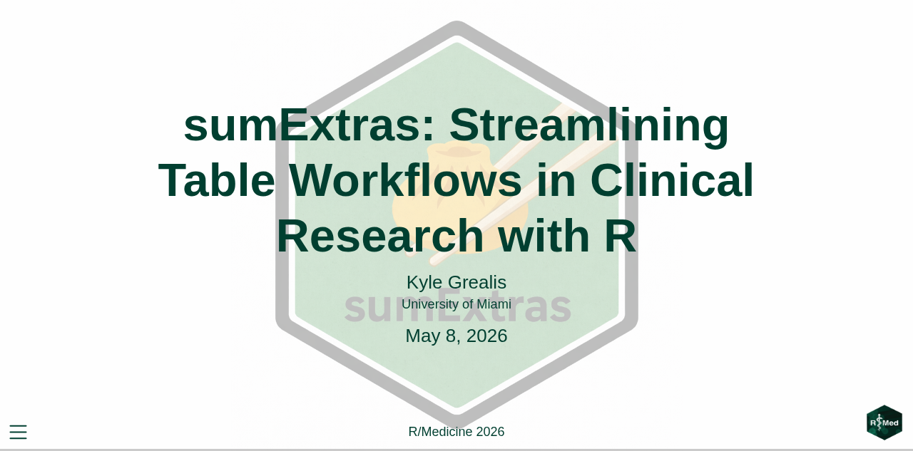
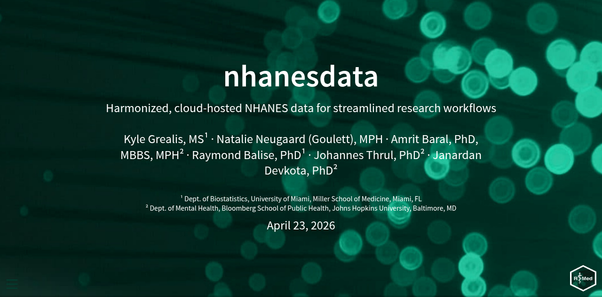

::: { .img-text }

::: { .img-group }
{target="_blank"}
:::

::: { .text-grp }

### sumExtras: Streamlining Table Workflows in Clinical Research

Slides for my R/Medicine 2026 talk on `sumExtras`, an R package for building publication-ready summary tables with minimal code. Covers the design philosophy, the core functions, and a live walkthrough of a clinical research workflow.

**R/Medicine 2026** · May 8

::: { .cntr-btn }
[View Slides](https://slides.kylegrealis.com/sumExtras){target="_blank" .btn}
:::

:::

:::

---

::: { .img-text }

::: { .img-group }
{target="_blank"}
:::

::: { .text-grp }

### nhanesdata: Working with NHANES in R

Slides from R/Medicine 2026 on `nhanesdata`, a package for importing, cleaning, and analyzing NHANES datasets in R. Focuses on reducing the friction between raw NHANES files and analysis-ready data frames.

**R/Medicine 2026** · May 7

::: { .cntr-btn }
[View Slides](https://slides.kylegrealis.com/nhanesdata){target="_blank" .btn}
:::

:::

:::

---

## Recordings

Video recordings coming soon. Check back after R/Medicine 2026.
