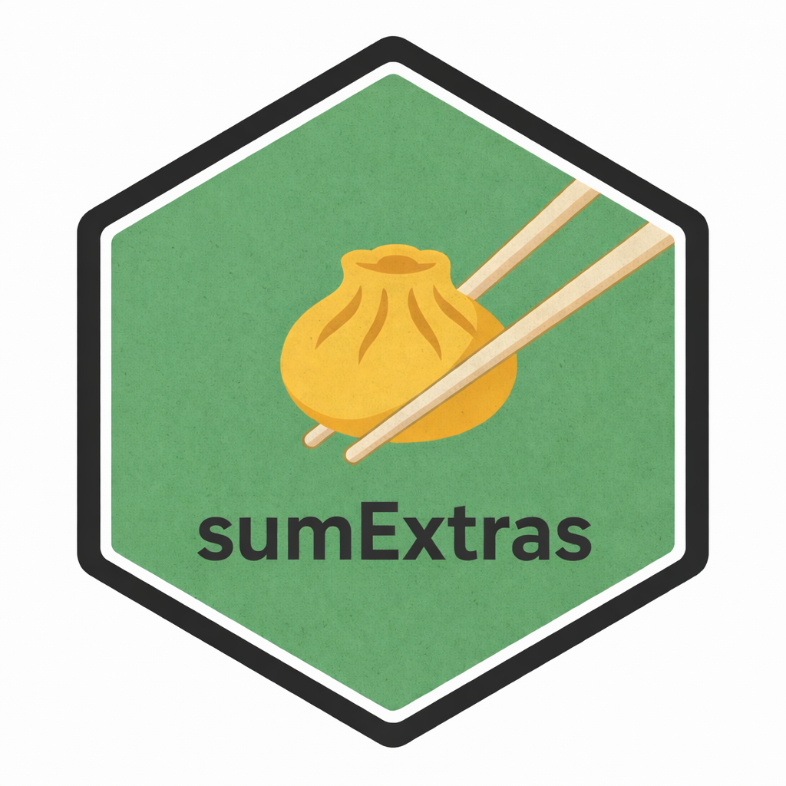
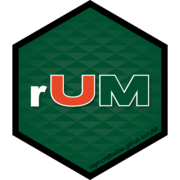

::: { .img-text }

::: { .img-group }
{target="_blank"}
:::

::: { .text-grp }

### sumExtras

sumExtras reduces boilerplate in clinical research table workflows. One call to `extras()` replaces the five or six `gtsummary` formatting steps that would otherwise clutter every analysis script.

* **Simplicity**: `extras()` consolidates variable labeling, missing value cleanup, theming, and group header styling into a single function
* **Flexibility**: Works with both `tbl_summary()` and `tbl_svysummary()` tables
* **Publication-ready**: Built-in JAMA compact themes and bold/italic group header formatting
* **Resilient**: Warn-and-continue design ensures tables always render, even if individual formatting steps fail

::: { .cntr-btn }
[Get it now!](https://www.kylegrealis.com/sumExtras/){target="_blank" .btn}
:::

:::

:::

---

::: { .img-text }

::: { .img-group }
{target="_blank"}
:::

::: { .text-grp }

### froggeR

froggeR provides project scaffolding for R and Quarto. Inspired by research compendium principles, it establishes consistent directory structures, pre-configured entry points, and global metadata so you set things up once and reuse across every project.

froggeR gets out of your way so you can focus on the work:

* **Structure**: Predictable `R/`, `analysis/`, `data/`, and `www/` directories out of the box
* **Consistency**: Global configuration for author metadata and branding across all projects
* **Security**: `.gitignore` and pre-commit hooks to keep sensitive files out of version control
* **Reproducibility**: Templated Quarto documents with automatic metadata population

::: { .cntr-btn }
[Get it now!](https://www.kylegrealis.com/froggeR/){target="_blank" .btn}
:::

:::

:::

---

::: { .img-text }

::: { .img-group }
{target="_blank"}
:::

::: { .text-grp }

### nhanesdata

nhanesdata provides simplified access to the National Health and Nutrition Examination Survey (NHANES), a U.S. public health dataset spanning 1999 to 2023. It solves two persistent pain points: unreliable CDC server access and confusing dataset naming conventions across survey cycles.

* **Reliability**: All datasets hosted on cloud storage, no CDC server timeouts
* **Ready to use**: Pre-merged datasets with a `year` column for cycle tracking across demographics, biomarkers, physical measurements, and dietary data
* **Survey-aware**: `create_design()` handles proper weighting out of the box
* **Discoverable**: `term_search()` and `var_search()` let you find variables by keyword or name

::: { .cntr-btn }
[Get it now!](https://www.kylegrealis.com/nhanesdata/){target="_blank" .btn}
:::

:::

:::

---

::: { .img-text }

::: { .img-group }
{target="_blank"}
:::

::: { .text-grp }

### nascaR.data

nascaR.data provides historical race results from NASCAR's top three series: Cup (1949-present), Xfinity (1982-present), and Trucks (1995-present). Explore driver, team, and manufacturer performance in a race-by-race, season, or career format. This data has been expertly curated and scraped with permission from [DriverAverages.com](https://driveraverages.com/){target="_blank"}.

::: { .cntr-btn }
[Get it now!](https://kylegrealis.github.io/nascaR.data/){target="_blank" .btn}
:::

:::

:::

---

::: { .img-text }

::: { .img-group }
{target="_blank"}
:::

::: { .text-grp }

### rUM

This is a collection of R things from your friends at UM (The University of Miami).

rUM includes:

+ A research project template.  It creates a new RStudio project that has your choice of an `analysis.qmd` Quarto file or `analysis.Rmd` R markdown file with tidyverse and conflicted.
+ Quarto and R Markdown templates which include they YAML header and start up blocks that load the tidyverse and conflicted packages.

* 💥 NEW in Version 2.0.0 (Overproof Rum) 💥 `rUM` now can make a package project that includes a paper outline as a vignette.  `rUM` can now add an example table and figure to it's paper shell.

::: { .cntr-btn }
[Get it now!](https://github.com/RaymondBalise/rUM/){target="_blank" .btn}
:::

:::

:::
